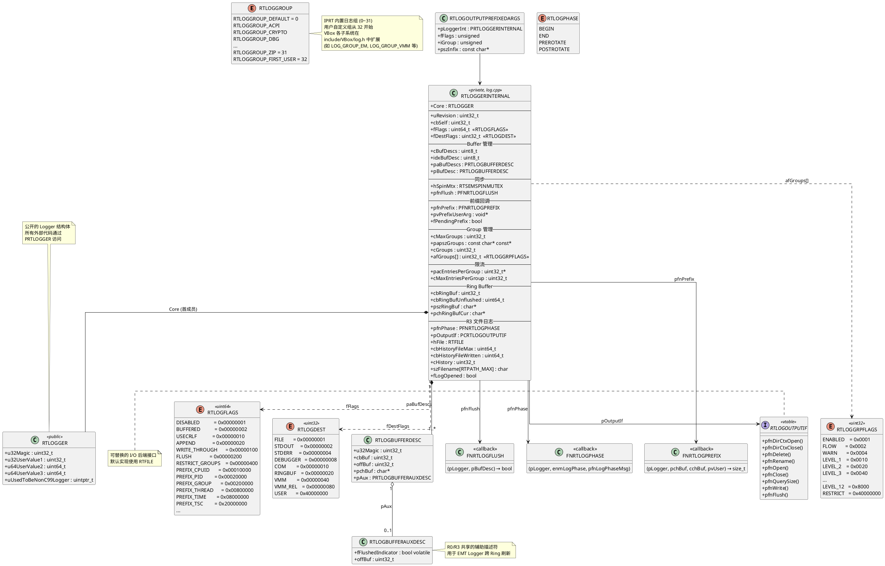
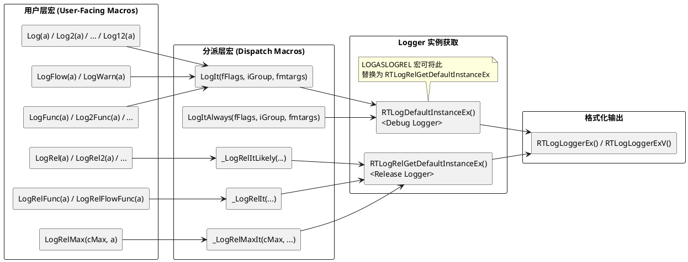
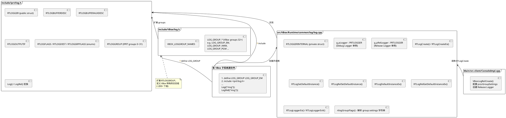
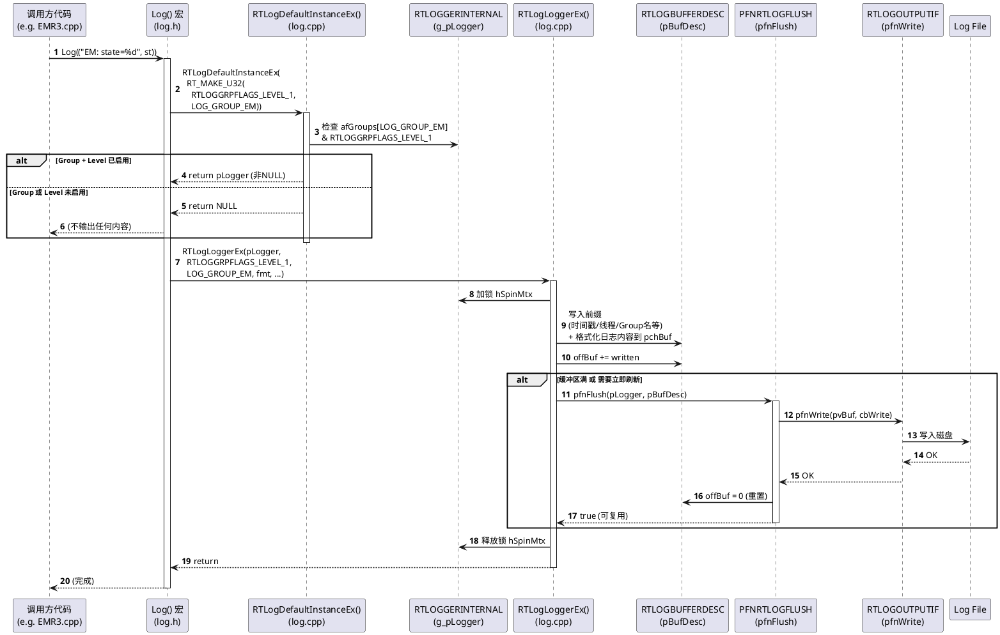
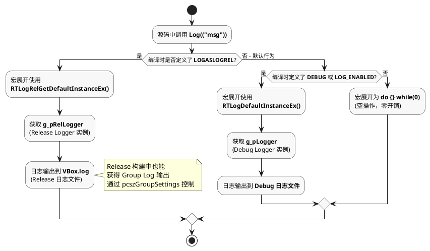
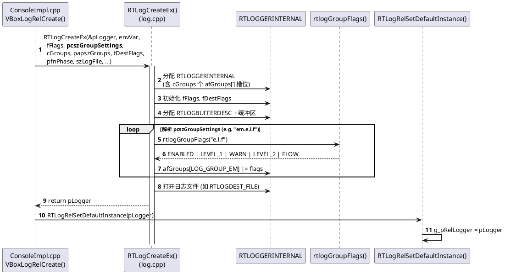
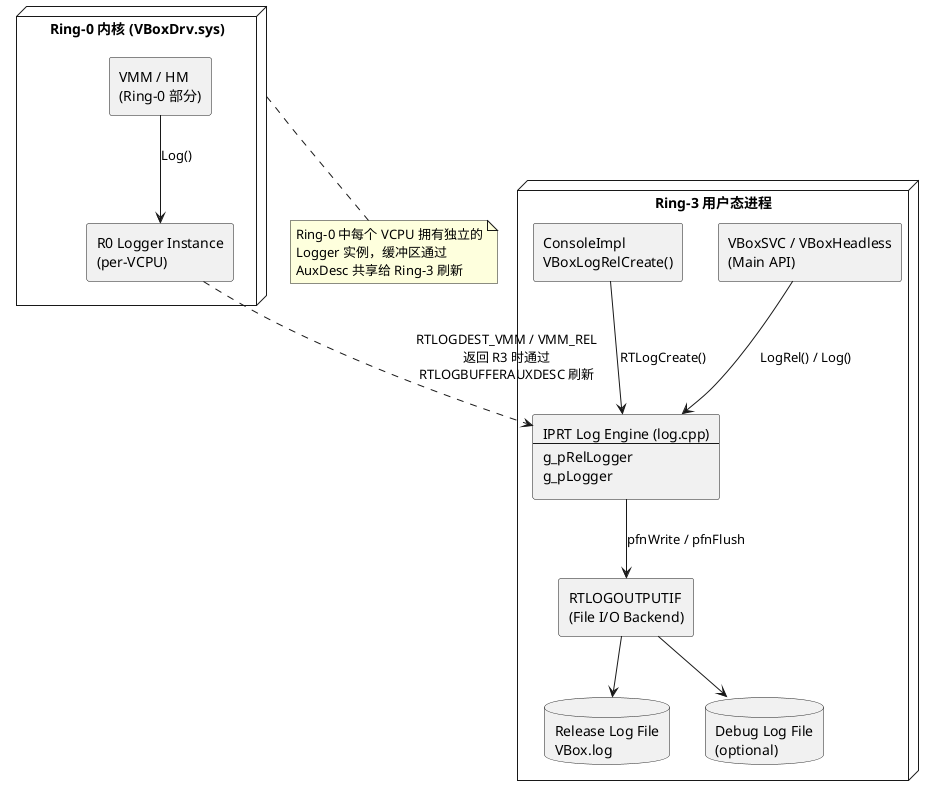

# VBox 日志系统架构文档

本文档对 VirtualBox (IPRT) 日志系统进行架构拆解，采用 4+1 架构视图模型，从三个结构维度展开：

| 结构维度 | 采用视图 | 关注点 |
|----------|----------|--------|
| **静态结构** | Logical View + Development View | 类/结构体关系、宏层级、模块组织 |
| **动态结构** | Process View | 运行时调用流程、并发与线程交互 |
| **分配结构** | Allocation View (Physical/Deployment) | 组件在 Ring-0/Ring-3 中的分布与映射 |

---

# 1. 静态结构

## 1.1 Logical View — 核心类图

以下类图展示日志系统的核心数据结构及其关系。



## 1.2 Logical View — 宏层级结构图

以下展示用户可见的日志宏如何逐层展开到底层 API。



## 1.3 Development View — 模块组织与源文件依赖

从源文件组织角度展示日志系统的模块划分、全局单例关系以及各子系统的引用方式。



---

# 2. 动态结构

## 2.1 Process View — 日志调用时序

展示一次典型的 `Log()` 宏调用的完整执行路径，包含 Group/Level 门控检查、缓冲区写入和条件刷新。



## 2.2 Process View — LOGASLOGREL 重定向机制

展示 NetEase 自定义的 `LOGASLOGREL` 宏如何在编译期改变日志流向。



## 2.3 Process View — Logger 创建与初始化时序

展示 VBox 启动时 Release Logger 的创建和全局注册过程。



---

# 3. 分配结构

## 3.1 Allocation View — Ring-0 / Ring-3 组件部署

展示日志系统组件在 VBox 进程和内核驱动中的物理分布，以及跨 Ring 的日志缓冲区共享机制。



---

# 附录

## A. 关键源文件索引

| 文件 | 说明 |
|------|------|
| `include/iprt/log.h` | 日志系统公共头文件：宏定义、公共结构体、API 声明 |
| `include/VBox/log.h` | VBox 扩展日志组定义 (LOG_GROUP_*) |
| `src/VBox/Runtime/common/log/log.cpp` | 日志系统核心实现：RTLOGGERINTERNAL、RTLogCreate、RTLogLoggerEx 等 |
| `Main/src-client/ConsoleImpl.cpp` | Release Logger 创建入口 (VBoxLogRelCreate) |

## B. NetEase 定制说明 — LOGASLOGREL 宏

### B.1 背景与动机

VBox 原生的日志架构中，`Log()` / `Log2()` / `LogFlow()` 等 Debug 日志宏在 Release 构建中被预处理为空操作（`do {} while(0)`），完全不产生任何代码。要获取这些详细日志，必须切换到 Debug 构建（`KBUILD_TYPE=debug`），但 Debug 构建带来 `-O0` 优化级别和额外断言开销，性能大幅下降，不适合在接近生产的环境中排查问题。

`LOGASLOGREL` 是 NetEase 内部添加的一个 **编译期 hack 宏**（来源 patch: `vBox-Res/d0551b58a66250002c3564465eb2dd71c98896d1.patch`），目的是：**在保持 Release 构建优化级别的前提下，让 `Log()` 系列宏也能输出日志**。

### B.2 原理详解

`LOGASLOGREL` 宏对 `include/iprt/log.h` 做了两处关键改动：

#### 改动 1：编译门控条件扩展

```c
/* 原始代码 */
#if (defined(DEBUG) || defined(LOG_ENABLED)) && !defined(LOG_DISABLED)
# define LOG_ENABLED
#else
# define LOG_DISABLED
#endif

/* LOGASLOGREL 改动后 */
#if (defined(DEBUG) || defined(LOG_ENABLED) || defined(LOGASLOGREL)) && !defined(LOG_DISABLED)
# define LOG_ENABLED
#else
# define LOG_DISABLED
#endif
```

**效果**：即使是 Release 构建（没有 `DEBUG` 或 `LOG_ENABLED`），只要定义了 `LOGASLOGREL`，`LOG_ENABLED` 就会被定义。这使得 `Log()` / `LogFlow()` 等宏不再被编译为空操作，而是展开为实际的日志调用代码。

#### 改动 2：Logger 实例获取函数替换

```c
/* 原始代码 — Log() 走 Debug Logger */
PRTLOGGER LogIt_pLogger = RTLogDefaultInstanceEx(RT_MAKE_U32(a_fFlags, a_iGroup));
                          ^^^^^^^^^^^^^^^^^^^^^^^^
                          获取 g_pLogger (Debug Logger 单例)

/* LOGASLOGREL 启用后 — Log() 走 Release Logger */
PRTLOGGER LogIt_pLogger = RTLogRelGetDefaultInstanceEx(RT_MAKE_U32(a_fFlags, a_iGroup));
                          ^^^^^^^^^^^^^^^^^^^^^^^^^^^^^
                          获取 g_pRelLogger (Release Logger 单例)
```

**效果**：`Log()` 系列宏虽然在语法上是 "Debug 日志"，但实际获取的 Logger 实例是 Release Logger。这意味着：

- 日志输出到 **VBox.log**（Release Logger 的默认日志文件）
- 日志组的启用/禁用由 `VBoxLogRelCreate()` 的 `pcszGroupSettings` 参数控制
- 无需配置 `VBOX_LOG` 等 Debug Logger 环境变量

### B.3 数据流对比

| 维度 | 正常 Debug 构建 | LOGASLOGREL Release 构建 |
|------|-----------------|--------------------------|
| `Log()` 编译状态 | ✅ 编译为日志调用 | ✅ 编译为日志调用 |
| 底层 Logger | `g_pLogger` (Debug Logger) | `g_pRelLogger` (Release Logger) |
| 日志组控制入口 | `VBOX_LOG` 环境变量 | `ConsoleImpl.cpp` 中 `pcszGroupSettings` 参数 |
| 日志输出文件 | Debug 日志文件 | **VBox.log** (Release 日志文件) |
| 优化级别 | `-O0` (R3) | **`-O2`** (保持 Release 优化) |
| 断言开销 | 全部启用 (`RT_STRICT` / `VBOX_STRICT`) | **不启用** |
| `LogRel()` 行为 | 不受影响 | 不受影响 |

### B.4 启用方式

1. **反注释宏定义** — 编辑 `include/iprt/log.h`，找到以下行并取消注释：
   ```c
   // #define LOGASLOGREL
   ```
   改为：
   ```c
   #define LOGASLOGREL
   ```

2. **配置日志组** — 编辑 `Main/src-client/ConsoleImpl.cpp`，修改 `com::VBoxLogRelCreate` 调用中的 `pcszGroupSettings` 参数：
   ```c
   /* 示例：启用 EM 模块的 Level-1 日志和执行流日志 */
   pcszGroupSettings = "em.e.l.f";
   
   /* 示例：启用所有模块，排除噪音模块 */
   pcszGroupSettings = "all -drv_nat -pgm_phys";
   ```

3. **重新编译**：
   ```cmd
   cd vBox-Src
   out\env.bat
   kmk    # Release 编译即可
   ```

### B.5 注意事项

- **全局影响**：`LOGASLOGREL` 是在公共头文件 `log.h` 中定义的，启用后会影响 **所有** 包含该头文件的编译单元。整个 VBox 代码树中所有 `Log()` 调用都会被激活。
- **性能影响**：虽然保持了 `-O2` 优化，但大量 `Log()` 调用被激活后会产生显著的 I/O 和 CPU 开销。建议通过 `pcszGroupSettings` 精确控制只启用需要调试的模块。
- **不影响 `LogRel()`**：`LogRel()` 系列宏始终走 Release Logger，不受 `LOGASLOGREL` 影响。
- **Patch 管理**：此改动来源于 `vBox-Res/d0551b58a66250002c3564465eb2dd71c98896d1.patch`，如果需要在干净的源码树上应用，使用：
  ```cmd
  cd vBox-Src
  git apply --ignore-whitespace --exclude="README.md" ..\vBox-Res\d0551b58a66250002c3564465eb2dd71c98896d1.patch
  ```

详细的操作步骤和调试场景请参见 [VBox-debug-guide.md](VBox-debug-guide.md) 第 3.5 节。
